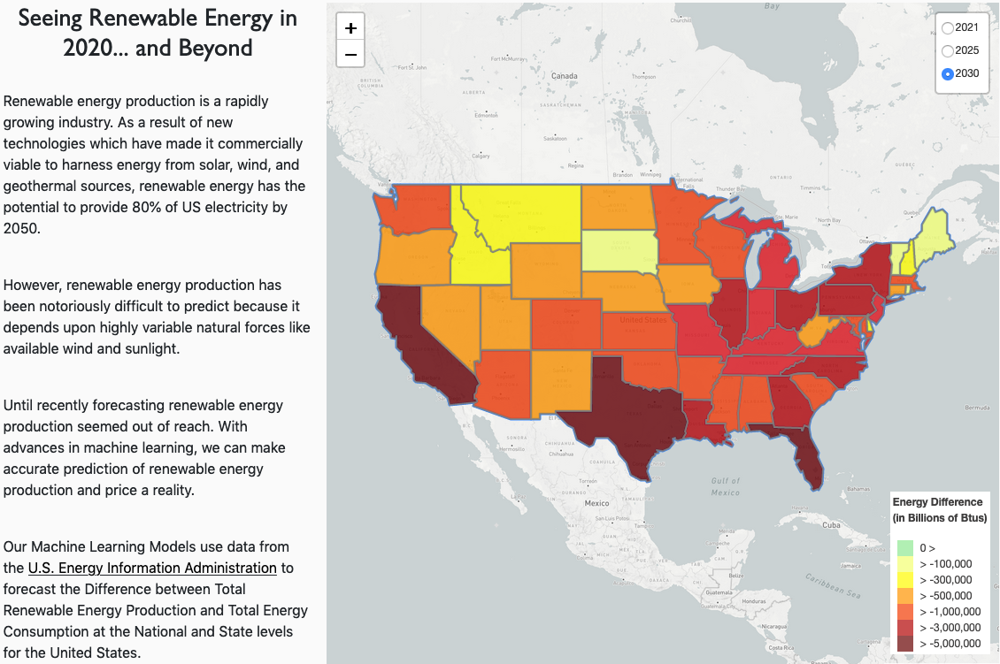

# Renewable Energy

### Description:

For this project, we used machine learning to predict the difference between a state's energy demand and its renewable energy production 1, 5, and 10 years from the present. 

### Questions:

* How renewable energy production will change in the US by state?
 
* Predict a state's ability to meet its Energy Consumption needs with Renewable Energy Production.

## Analysis

* Clean and modify the data using Pandas and Jupyter Notebook.

* Use Heroku and PostgreSQL as the database.

* Use Python as the server side language, Flask as the web server and SQLAlchemy as the ORM.

* Use HTML, CSS and JavaScript on the front end.

* Use Linear Regression model for machine learning.

* Use D3, Plotly and Leaflet to visualize the data. 

### Data Sources
* https://www.eia.gov/state/seds/seds-data-complete.php?sid=US#Consumption

* https://www.eia.gov/state/seds/seds-data-complete.php

* https://www.eia.gov/state/seds/seds-data-complete.php?sid=US#PricesExpenditures 

## Development Team
* Nadire Gokcehan - [@nadireag](https://github.com/nadireag)
* Reid Powell - [@ReidP31](https://github.com/ReidP31)
* Saba Tass - [@Saba](https://github.com/SabaTass)
* Kenneth Edwards - [@Kenneth Edwards](https://github.com/Kenneth-Edwards)
* Cassy Myers - [@Cassy Myers](https://github.com/CassPMyers)
